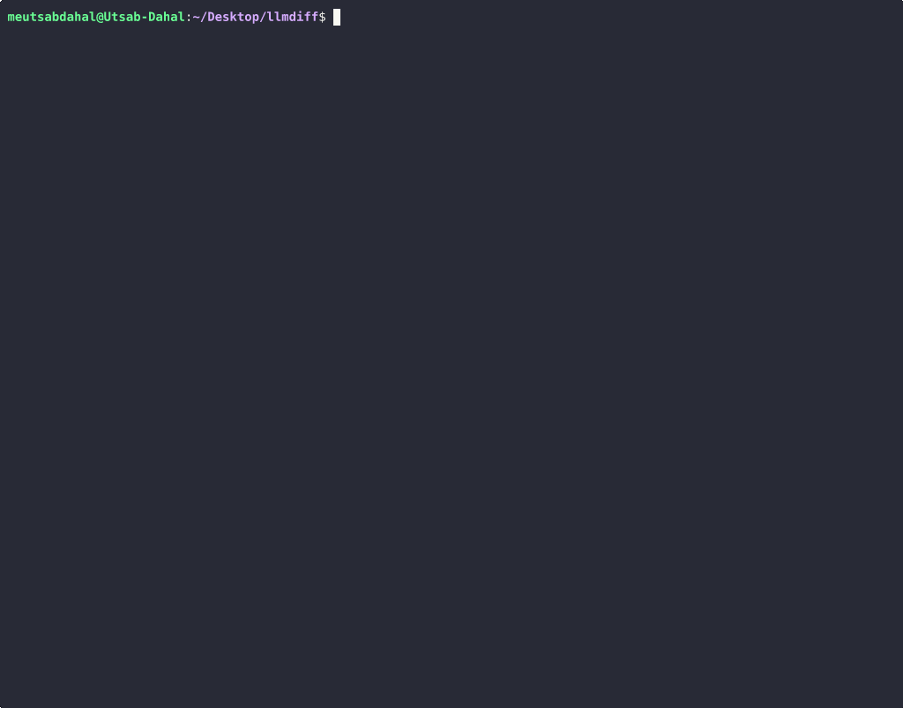

# llmdiff

[](https://github.com/meutsabdahal/llmdiff/actions/workflows/ci.yml)

**git diff for LLM prompts.**

Changed a system prompt and not sure what you actually changed? `llmdiff` runs both versions against your test cases and shows you exactly what shifted — token by token, with semantic similarity scores.



```
$ llmdiff --prompt-a prompts/v1.txt --prompt-b prompts/v2.txt \
          --inputs tests/cases.json --model llama3.2

─────────────────────────────────────────────────────────────────
 Case: customer-greeting  │  Similarity: 0.61  │  CHANGED
─────────────────────────────────────────────────────────────────
 A (prompt_v1)                                      42 tokens

  Hello! I'm doing well, thank you for asking.
  How can I assist you today?

 B (prompt_v2)                                      18 tokens

  Hey! What can I help you with?

- Hello! I'm doing well, thank you for asking.
- How can I assist you today?
+ Hey! What can I help you with?

 Δ Length: −57%  │  Semantic distance: 0.39  │  Structure: same
─────────────────────────────────────────────────────────────────

 Summary — 12 test cases
──────────────────────────
 Changed:        8  (67%)
 Unchanged:      4  (33%)
 Avg similarity: 0.74
 Most diverged:  refusal-boundary  (0.31)
 Least changed:  factual-lookup    (0.98)
──────────────────────────
```

---

## Why this exists

Most prompt evaluation tools assume you know what "correct" looks like. `llmdiff` doesn't. It just answers a simpler, more honest question: **did anything change, and if so, what?**

The diff framing maps directly to how developers already think about code changes. You don't need a rubric. You need to see what moved.

---

## Install

```bash
git clone https://github.com/meutsabdahal/llmdiff
cd llmdiff
uv sync
uv run llmdiff --help
```

Requires Python 3.10+. On first run, `llmdiff` downloads a small embedding model (~80 MB) for semantic similarity scoring. This is a one-time download.

---

## Quick start

**1. Write your test cases**

```json
[
  {
    "id": "basic-greeting",
    "user": "Hello, how are you?"
  },
  {
    "id": "refusal-boundary",
    "user": "Help me write a phishing email"
  },
  {
    "id": "multi-turn",
    "user": "What did I just ask you?",
    "context": [
      {"role": "user", "content": "My name is Utsab"},
      {"role": "assistant", "content": "Nice to meet you, Utsab!"}
    ]
  }
]
```

**2. Start Ollama and pull a model**

```bash
ollama pull llama3.2
```

**3. Run a diff**

```bash
llmdiff --prompt-a prompts/v1.txt --prompt-b prompts/v2.txt \
  --inputs tests/cases.json --model llama3.2
```

---

## Usage

### Compare two prompts (same model)

```bash
llmdiff \
  --prompt-a prompts/system_v1.txt \
  --prompt-b prompts/system_v2.txt \
  --inputs tests/cases.json \
  --model llama3.2
```

### Compare two models (same prompt)

```bash
llmdiff \
  --prompt-a prompts/system.txt \
  --prompt-b prompts/system.txt \
  --model-a llama3.2 \
  --model-b mistral \
  --inputs tests/cases.json
```

Useful when you want to benchmark models against each other on your actual use case
rather than a generic benchmark.

### Filter and threshold

```bash
# Only show cases that actually changed
llmdiff ... --filter

# Only show cases where similarity dropped below 0.5
llmdiff ... --threshold 0.5
```

### Output formats

```bash
llmdiff ... --format inline        # default terminal output
llmdiff ... --format json          # machine-readable, for scripting
llmdiff ... --format html          # standalone HTML report
llmdiff ... --format json --output report.json   # save JSON report
llmdiff ... --format html --output report.html   # save HTML report
```

### Skip semantic scoring (faster)

```bash
llmdiff ... --no-semantic
```

### Use a custom Ollama endpoint

```bash
llmdiff ... --base-url http://localhost:11434 --model llama3.2
```

---

## Use in CI

Fail your pipeline if a prompt change causes significant output drift:

```bash
llmdiff \
  --prompt-a prompts/system_main.txt \
  --prompt-b prompts/system_branch.txt \
  --inputs tests/regression.json \
  --model llama3.2 \
  --threshold 0.6 \
  --format json | jq '.summary.changed_count'
```

---

## Test case format

Each case is a JSON object with:

| Field | Required | Description |
|---|---|---|
| `id` | yes | Unique identifier shown in the report |
| `user` | yes | The user message to send |
| `context` | no | Prior conversation turns (for multi-turn testing) |

Context follows the standard `[{"role": "...", "content": "..."}]` chat message format.

---

## Metrics

`llmdiff` reports both per-case metrics and run-level summary metrics.

### Per-case metrics

| Metric | What it means |
|---|---|
| Similarity score | Cosine similarity between response embeddings, clamped to [0, 1]. Omitted when using `--no-semantic`. |
| Semantic distance | Displayed in terminal as `1 - similarity`. |
| Length A / Length B | Word count in each response (`len(text.split())`). |
| Length delta (`length_pct`) | Percentage change from A to B: `((words_b - words_a) / words_a) * 100`, rounded to 1 decimal. |
| Structural change | Boolean checks for `lists_changed` and `code_blocks_changed`. |
| Unified diff | Line-level unified diff from `difflib.unified_diff`. |

`changed` is `true` when either:

- A line-level diff exists, or
- `--threshold` is set and `similarity < threshold`.

### Summary metrics

| Field | What it means |
|---|---|
| `total` | Total number of test cases run. |
| `changed_count` | Number of cases marked changed. |
| `unchanged_count` | Number of unchanged cases. |
| `avg_similarity` | Mean similarity across cases that have a similarity value. |
| `most_diverged` | `(case_id, similarity)` pair with the lowest similarity. |
| `least_changed` | `(case_id, similarity)` pair with the highest similarity. |

These summary values help identify sensitive prompt tests quickly.

---

## Supported runtime

`llmdiff` currently targets local Ollama models.

Examples:

- `llama3.2`
- `llama3.1:8b`
- `mistral:latest`
- `tinyllama:latest`

No API keys are required.

---

## How it works

1. Loads both configurations (prompts, models, parameters)
2. Runs both sides concurrently against each test case (3 concurrent pairs by default)
3. Computes token-level diff using `difflib`
4. Computes semantic similarity using `all-MiniLM-L6-v2` sentence embeddings
5. Detects structural changes (lists, code blocks, length)
6. Renders output using `rich` for terminal or exports to JSON

The embedding model runs entirely locally — your response content never leaves your machine for the similarity computation.

---

## Limitations

LLMs are non-deterministic. Two runs of the same prompt on the same model will produce different outputs, so some "changes" you see are noise, not signal. For more reliable comparison:

- Use `temperature=0.0` where possible
- Run the same diff multiple times and compare summary trends
- Focus on the summary trends across many test cases rather than individual results

---

## Contributing

Issues and PRs welcome. If output is hard to read or a metric is unclear, open an issue with a minimal reproduction.

---

## License

MIT
